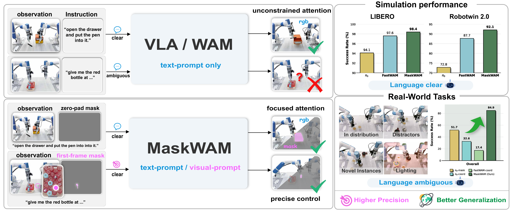
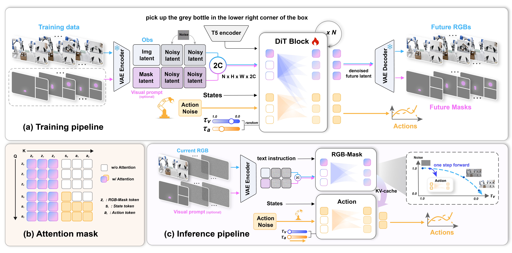

<div align="center">

# MaskWAM: Unifying Mask Prompting and Prediction for World-Action Models

<a href="https://arxiv.org/abs/2606.13515"></a> &nbsp;
<a href="https://hanyangyu1021.github.io/maskwam.github.io/"></a> &nbsp;
<a href="#"></a>

[Hanyang Yu](https://hanyangyu1021.github.io/)<sup>1</sup>,
[Haitao Lin](https://hetolin.github.io/)<sup>2</sup>,
[Jingbo Zhang](https://eckertzhang.github.io/)<sup>2</sup>,
[Wenyao Zhang](https://zhangwenyao1.github.io/)<sup>2</sup>,
[Chenghao Gu](https://chenghaogu.github.io/)<sup>3</sup>,
[Heng Li](https://hengli.me/)<sup>1</sup>,
[Ping Tan](https://ece.hkust.edu.hk/pingtan)<sup>1</sup>

<sup>1</sup>The Hong Kong University of Science and Technology  
<sup>2</sup>Tencent Robotics X, <sup>3</sup>Tsinghua University




</div>

This repository is the official implementation of **MaskWAM: Unifying Mask Prompting and Prediction for World-Action Models**.

**MaskWAM** is an object-centric **World-Action Model (WAM)** that unifies **mask prompting** and **mask prediction** for robotic manipulation. It uses masks both as explicit spatial prompts and as future prediction targets, enabling stronger target grounding, better distractor robustness, and improved generalization in both language-clear and language-ambiguous manipulation tasks.

---

## News

- **[2026.06.11] Paper released on arXiv.** Read it at [arXiv:2606.13515](https://arxiv.org/abs/2606.13515).
- **[2026.06.10] Code is coming soon.** We are finalizing training, inference, and evaluation code.
- **[2026.06.08] Project page released.** Please visit the [project website](https://hanyangyu1021.github.io/maskwam.github.io/) for videos and visualizations.

---

## Highlights

- **Mask prompting for spatial grounding.**  
  A first-frame target mask provides an explicit spatial anchor, reducing ambiguity when multiple similar objects appear in the scene.

- **Future mask prediction for object-centric learning.**  
  MaskWAM predicts future masks together with future RGB frames, encouraging the model to focus on task-relevant regions instead of distractors or backgrounds.

- **Unified RGB-mask-action modeling.**  
  RGB latents, mask latents, and action tokens are jointly modeled in a unified WAM framework.

- **Strong performance in simulation and real-world tasks.**  
  MaskWAM is evaluated on LIBERO, RoboTwin 2.0, and real-robot manipulation tasks.

---

## Overview

World-Action Models are promising for robotic control because they jointly model future visual dynamics and robot actions. However, existing WAMs still face important spatial bottlenecks:

1. **Text-only conditioning is ambiguous** in cluttered scenes, especially when multiple visually similar objects are present.
2. **RGB-only future prediction is weakly grounded**, so the model may focus on task-irrelevant backgrounds or distractors.
3. **Visual prompting and future prediction are often separated**, limiting the ability of spatial prompts to directly shape action generation.

MaskWAM addresses these issues by integrating object masks into WAMs in two complementary ways:

- **Mask as input:** an optional first-frame mask prompt specifies the target object.
- **Mask as output:** future mask prediction provides object-centric supervision.
- **Mask as part of world-action modeling:** RGB, masks, and actions are jointly learned in one unified architecture.

---

## Method

<div align="center">

</div>

MaskWAM jointly predicts future RGB frames, future masks, and action chunks under a unified world-action modeling framework.

---


## Visualization Results

More real-robot videos are available on the [project page](https://hanyangyu1021.github.io/maskwam.github.io/).

The project page includes demonstrations for:

- Language-clear tasks: stacking bowls, hanging a mug, drawer manipulation, and towel folding.
- Language-ambiguous tasks: target bowl, target cup, target bottle, and target cosmetics.
- Generalization settings: in-distribution, distractors, novel instances, and lighting changes.

---

## Getting Started

The code is currently being prepared for release.

We plan to release:

- Training code
- Inference code
- Model checkpoints
- Data preparation tools
- LIBERO evaluation scripts
- RoboTwin 2.0 evaluation scripts
- Real-robot deployment examples

---

## TODO

- [ ] Release training code
- [ ] Release inference code
- [ ] Release model checkpoints
- [ ] Release data preparation tools
- [ ] Release LIBERO evaluation scripts
- [ ] Release RoboTwin 2.0 evaluation scripts
- [ ] Add installation instructions
- [ ] Add real-robot deployment instructions

---

## Citation

If you find MaskWAM useful in your research, please consider citing:

```bibtex
@article{yu2026maskwam,
  title   = {MaskWAM: Unifying Mask Prompting and Prediction for World-Action Models},
  author  = {Hanyang Yu and Haitao Lin and Jingbo Zhang and Wenyao Zhang and Chenghao Gu and Heng Li and Ping Tan},
  journal = {arXiv preprint arXiv:2606.13515},
  year    = {2026}
}
